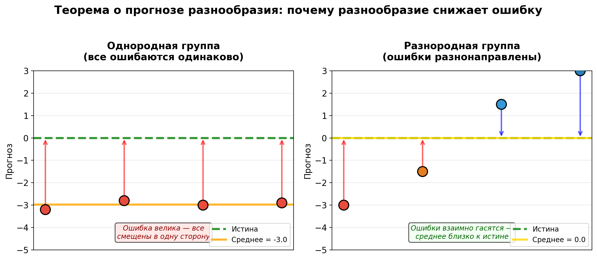

---
## Author
author:
  name: Жукова Арина Александровна
  degrees: 3rd year student
  orcid: 0000-0002-0877-7063
  email: 1132239120@rudn.ru
  affiliation:
    - name: Российский университет дружбы народов
      country: Российская Федерация
      postal-code: 117198
      city: Москва
      address: ул. Миклухо-Маклая, д. 6
## Title
title: "Теорема о прогнозе разнообразия"
subtitle: "Как Гальтон, Пейдж и толпа доказали силу разногласий"
license: "CC BY"
date: today
date-format: "YYYY-MM-DD"
incremental: false
---

# Информация

## Докладчик

:::::::::::::: {.columns align=center}
::: {.column width="70%"}

  * Жукова Арина Александровна
  * Студентка 3 курса
  * Российский университет дружбы народов
  * [1132239120@rudn.ru](mailto:1132239120@rudn.ru)

:::
::: {.column width="30%"}

 
:::
::::::::::::::

::: notes
- Здравствуйте! Тема — теорема о прогнозе разнообразия.
- Расскажу, откуда она взялась, как работает математически и где применяется.
:::

# Вводная часть

## Актуальность

- Групповые решения окружают нас везде: студсовет, совет директоров, биржевые прогнозы.
- Интуитивно мы доверяем одному эксперту, но история и математика говорят об обратном.
- Теорема о прогнозе разнообразия объясняет, почему «коллективный разум» — не метафора, а строгий закон.
- Понимание этого закона критически важно для управления, аналитики и принятия решений.

::: notes
- В двух словах: мы склонны переоценивать одного «гуру» и недооценивать разношёрстную группу. Математика поправляет эту интуицию.
- Время на слайд: ~1 минута.
:::

## Историческая справка: Фрэнсис Гальтон (1906)

- 1906 год, Плимут, сельскохозяйственная выставка.
- Задача для посетителей: угадать вес быка.
- Сэр Фрэнсис Гальтон, статистик, собрал 787 бюллетеней.
- **Истина:** 1198 фунтов. **Среднее толпы:** 1197 фунтов.
- Ошибка < 0.1%. Толпа оказалась точнее экспертов-скотоводов.

::: notes
- Гальтон пошёл на ярмарку, чтобы доказать глупость толпы. А ушёл с результатом, который его потряс.
- Он назвал это «Vox Populi» — глас народа. Статья вышла в журнале Nature в 1907 году.
- Это был первый строго задокументированный случай «мудрости толпы».
:::

## Историческая справка: Скотт Пейдж и Джеймс Шуровьески (2000-е)

- Феномен Гальтона оставался эмпирическим казусом почти 100 лет.
- В 2004 году Джеймс Шуровьески публикует книгу «Мудрость толпы», обобщив десятки кейсов.
- В 2007 году профессор Скотт Пейдж выводит математическое тождество — *теорему о прогнозе разнообразия*.
- **Итог:** эмпирика + строгая математика = закон коллективного прогноза.

::: notes
- Шуровьески описал условия: разнообразие, независимость, децентрализация, агрегация.
- Пейдж сказал: «Это не магия, это алгебра» — и вывел формулу, которую мы сейчас разберём.
- Научный путь: от удивления Гальтона — к инструменту управления.
:::

## Объект и предмет исследования

- **Объект:** коллективное принятие решений и прогнозирование.
- **Предмет:** математическая связь между точностью группы, компетентностью участников и их разнообразием (теорема о прогнозе разнообразия).

::: notes
- Объект широкий — групповая динамика.
- Предмет узкий — конкретное тождество, которое связывает ошибку и разброс мнений.
:::

## Цели и задачи

- **Цель:** Понять и продемонстрировать теорему о прогнозе разнообразия в историческом и математическом контексте.

- **Задачи:**

    1. Кратко осветить историю: от Гальтона до Пейджа.
    2. Сформулировать теорему человеческим языком и математически.
    3. Привести численный пример, разобрав каждый компонент формулы.
    4. Обсудить практические выводы и ограничения.

::: notes
- Четыре задачи — четыре шага: история, формула, пример, выводы.
- После истории переходим к главному блюду — математике.
:::

## Материалы и методы

- **Теоретическая база:**
  - классический эксперимент Фрэнсиса Гальтона (1906);
  - концепция «мудрости толпы» Джеймса Шуровьески;
  - математическое тождество Скотта Пейджа — теорема о прогнозе разнообразия.

- **Метод исследования:**
  - аналитический разбор математического тождества;
  - численный модельный эксперимент на простом примере (прогноз температуры).

- **Инструменты:**
  - Python (расчёты и визуализация);
  - Quarto + LaTeX (оформление презентации).

::: notes
- В основе — проверенные академические источники.
- Пример намеренно простой, чтобы пересчитать в уме.
:::

# Содержание исследования

## Ошибка толпы и её компоненты (главное тождество)

$$
\underbrace{(\bar{x} - \mu)^2}_{\text{Ошибка толпы}} \;=\;
\underbrace{\frac{1}{N}\sum_{i=1}^{N}(x_i - \mu)^2}_{\text{Средняя индивидуальная ошибка}} \;-\;
\underbrace{\frac{1}{N}\sum_{i=1}^{N}(x_i - \bar{x})^2}_{\text{Разнообразие прогнозов}}
$$

- $\bar{x}$ — средний коллективный прогноз,
- $\mu$ — истинное значение,
- $\frac{1}{N}\sum(x_i - \bar{x})^2$ — «бонус разнообразия».

::: notes
- Это тождество, оно выполняется всегда и для любых чисел.
- Весь фокус в компоненте «разнообразие». Если группа однородна (все сказали одно и то же), это слагаемое равно нулю — и ошибка толпы равна средней ошибке.
- Если же люди ошибаются в разные стороны, бонус вычитается и ошибка падает.
- Именно это случилось у Гальтона: люди ошибались кто в плюс, кто в минус — и среднее попало почти в яблочко.
:::

## Численный пример: угадываем температуру

| Участник | Прогноз ($x_i$) | $\mu=22^\circ C$ |
|----------|-----------------|------------------|
| Аня      | 20              |                  |
| Борис    | 21              |                  |
| Вика     | 23              |                  |
| Глеб     | 24              |                  |
| **Среднее** | **22.0**    |                  |

- Средняя ошибка участников: $(4+1+1+4)/4 = 2.5$
- Разнообразие прогнозов: $(4+1+1+4)/4 = 2.5$
- Ошибка толпы: $2.5 - 2.5 = 0$

::: notes
- Ситуация как у Гальтона: никто не угадал, а группа угадала идеально.
- Двое занизили, двое завысили. Ошибки взаимно уничтожились.
- Если бы все как один сказали 23, ошибка группы была бы 1. Разнообразие = 0 не дало бы «скидки».
:::

## Визуализация принципа

:::::::::::::: {.columns align=center}
::: {.column width="70%"}

{#fig-scheme width=75%}

:::
::: {.column width="30%"}

- Слева: согласованная, но смещённая группа — ошибка велика.
- Справа: разнородная группа — центр масс ближе к истине.
 
:::
::::::::::::::

::: notes
- Картинка — суть доклада.
- Слева — «групповое мышление» (groupthink), все думают одинаково и ошибаются одинаково.
- Справа — когнитивное разнообразие, компенсация смещений.
:::

## Практические условия «мудрой толпы»

1. **Независимость** — люди формируют мнение сами, без оглядки на других.
2. **Децентрализация** — у каждого свой уникальный опыт и информация.
3. **Агрегация** — есть механизм справедливого усреднения.

::: notes
- Это условия Шуровьески, при которых бонус разнообразия реализуется на практике.
- Если люди подглядывают друг за другом (эффект стада), их мнения коррелируют — разнообразие падает, теорема перестаёт давать выигрыш.
- Пример из бизнеса: если все аналитики пересказывают один и тот же отчёт Bloomberg, толку от их «коллективного прогноза» немного.
:::

# Результаты и выводы

## Итоги

- Исторически: от случайного открытия Гальтона (1906) до строгой теории Пейджа (2007).
- Математически: ошибка группы = средняя ошибка – разнообразие. Это тождество, работающее всегда.
- Практически: разнообразие мнений — это «страховка» от коллективных ошибок.
- Рецепт: формируя команду аналитиков, ищите не единомышленников, а людей с разным бэкграундом, разными ментальными моделями.

::: notes
- Главное: теорема — это не совет «нанимайте кого попало». Это совет «не нанимайте клонов».
- Компетентность всё ещё важна (она снижает первое слагаемое), но разнообразие снижает итог дополнительно.
- Спасибо за внимание, готов ответить на вопросы.
:::

