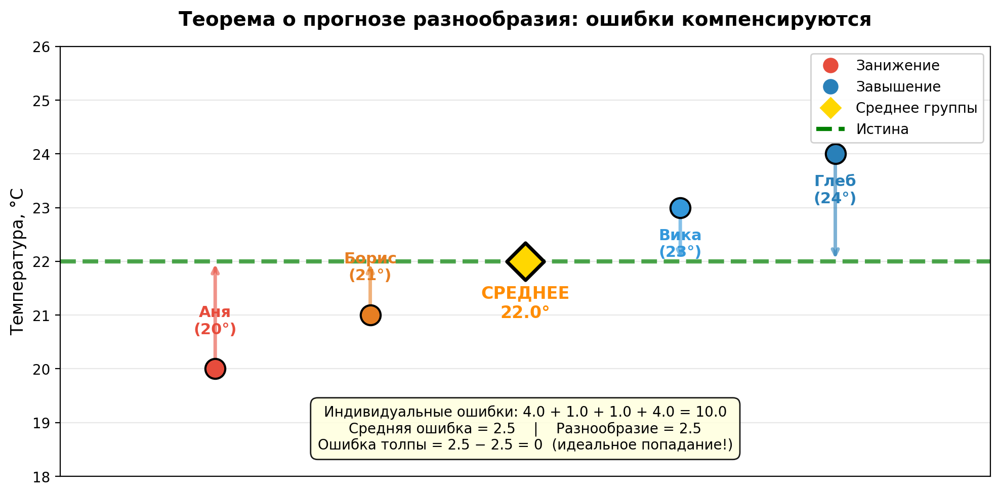

---
## Author
author:
  name: Жукова Арина Александровна
  degrees: 3rd year student
  orcid: 0000-0002-0877-7063
  email: 1132239120@rudn.ru
  affiliation:
    - name: Российский университет дружбы народов
      country: Российская Федерация
      postal-code: 117198
      city: Москва
      address: ул. Миклухо-Маклая, д. 6

## Title
title: "Теорема о прогнозе разнообразия: почему толпа бывает умнее эксперта"
subtitle: "Доклад по дисциплине «Математическое моделирование»"
license: "CC BY"
---

# Цель работы

Цель доклада — разобрать теорему о прогнозе разнообразия (Diversity Prediction Theorem), проследить её исторические корни, сформулировать математическую суть и показать на примерах, почему коллективные решения часто оказываются точнее индивидуальных, даже если в группе нет выдающихся экспертов.

# Задание

В рамках доклада необходимо:

- кратко осветить историю вопроса: от Гальтона до Пейджа;
- объяснить теорему о прогнозе разнообразия «на пальцах» и формально;
- привести простой численный пример (см. [табл. @tbl-example]);
- обсудить, при каких условиях коллективный разум действительно работает (см. [@scott_page_diversity_2007; @surowiecki_wisdom_2005]);
- сделать выводы о практической значимости для управления и аналитики.

# Теоретическое введение

## Исторический контекст: как толпа стала «мудрой»

Идея о том, что коллектив может быть умнее отдельного специалиста, витала в воздухе давно, но научное оформление она получила чуть больше ста лет назад благодаря случаю на сельскохозяйственной выставке.

**Фрэнсис Гальтон и бык на ярмарке (1906 год).**
Английский учёный-энциклопедист, антрополог и статистик сэр Фрэнсис Гальтон посетил выставку домашнего скота в Плимуте. Там проводился конкурс: посетителям предлагали угадать вес выставленного быка. Гальтон, будучи человеком скептического склада и высокого мнения об экспертах, попросил у организаторов 787 заполненных бюллетеней. Он хотел доказать, что «простая толпа» глупа и её среднее мнение будет далеко от истины.

Он вычислил среднее арифметическое всех предположений. Истинный вес быка составлял 1198 фунтов. **Среднее толпы оказалось 1197 фунтов.** Ошибка составила менее 0.1% — толпа побила не только большинство индивидуальных участников, но и оценки скотоводов-экспертов. Гальтон, вопреки собственным ожиданиям, опубликовал статью «Глас народа» (Vox Populi, 1907), где признал коллективный разум статистическим феноменом [@galton_vox_1907].

**Развитие идеи в XXI веке.**
Феномен оставался скорее эмпирическим наблюдением, пока в 2000-х годах профессор Мичиганского университета **Скотт Пейдж** не придал ему строгую математическую форму. В своих работах [@scott_page_difference_2008] он вывел тождество, известное сегодня как *теорема о прогнозе разнообразия*. Параллельно журналист Джеймс Шуровьески обобщил множество кейсов — от угадывания количества драже в банке до поиска пропавшей подлодки — в книге «Мудрость толпы» [@surowiecki_wisdom_2005], выделив четыре условия «умной толпы»: разнообразие, независимость, децентрализация и агрегация.

Таким образом, теорема Пейджа закрыла вопрос «почему это работает», сведя его к простой алгебре.

## Интуиция и формальная запись

**Интуиция:** ошибка коллективного прогноза равна средней индивидуальной ошибке минус разнообразие прогнозов. Разнообразие выступает как «скидка» на коллективную ошибку.

**Формальная запись.**
Пусть $N$ человек независимо дают численные прогнозы $x_i$ относительно истинного значения $\mu$. Обозначим коллективный прогноз как среднее арифметическое:

$$
\bar{x} = \frac{1}{N}\sum_{i=1}^{N} x_i
$$

Тогда выполняется тождество:

$$
(\bar{x} - \mu)^2 = \frac{1}{N}\sum_{i=1}^{N}(x_i - \mu)^2 \;-\; \frac{1}{N}\sum_{i=1}^{N}(x_i - \bar{x})^2
$$

Где:

- $(\bar{x} - \mu)^2$ — квадрат ошибки толпы,
- $\frac{1}{N}\sum(x_i - \mu)^2$ — средняя индивидуальная ошибка,
- $\frac{1}{N}\sum(x_i - \bar{x})^2$ — дисперсия (разнообразие) прогнозов.

**Ключевой вывод:** при фиксированной средней ошибке участников, чем больше разброс их мнений (дисперсия), тем меньше ошибка группы.

## Условия, когда это работает на практике
Тождество истинно всегда, но чтобы разнообразие действительно приносило пользу, а не становилось источником хаоса, требуются три институциональных условия:

1. **Независимость** — люди не подстраиваются под мнение друг друга.
2. **Децентрализация** — каждый опирается на собственные знания и опыт.
3. **Агрегация** — существует механизм сбора и усреднения частных оценок.

# Выполнение работы (численный эксперимент)

Представим, что мы просим четырех студентов угадать температуру в аудитории (истина: $\mu = 22.0$ °C). Студенты называют: 20, 21, 23, 24. Их оценки и расчёты приведены в таблице.

| Студент | Прогноз $x_i$ | Ошибка $(x_i - \mu)^2$ | Отклонение от среднего $(x_i - \bar{x})^2$ |
|---------|--------------|------------------------|--------------------------------------------|
| 1       | 20           | 4.0                    | 4.0                                        |
| 2       | 21           | 1.0                    | 1.0                                        |
| 3       | 23           | 1.0                    | 1.0                                        |
| 4       | 24           | 4.0                    | 4.0                                        |
| **Среднее $\bar{x}$** | **22.0** | **2.5** (средняя инд. ошибка) | **2.5** (разнообразие) |

: Пример коллективного прогноза температуры {#tbl-example}

Подставляем в теорему:

- Ошибка толпы: $(\bar{x} - \mu)^2 = (22 - 22)^2 = 0$
- Проверка тождества: $2.5 - 2.5 = 0$

**Интерпретация:** Ни один студент не угадал точно (ошибки 4, 1, 1, 4), но их среднее (22.0) совпало с истиной. Разнообразие «съело» все ошибки. Если бы все сказали, например, 23, ошибка группы была бы 1.0 и не скомпенсировалась бы.

Иллюстрация того, как смещённые, но разнонаправленные прогнозы дают точный центр, показана на [рис. @fig-diversity].

{#fig-diversity width=80%}

# Выводы

1. Теорема о прогнозе разнообразия имеет как минимум вековую эмпирическую историю (опыт Гальтона) и строгое математическое обоснование (тождество Пейджа).
2. Это не метафора, а алгебраический закон: ошибка группы = средняя ошибка – разнообразие.
3. Разнообразие мнений так же важно для точности, как и компетентность. «Умная толпа» всегда лучше «толпы клонов».
4. Практический рецепт: в менеджменте, прогнозировании и экспертных оценках необходимо сознательно культивировать когнитивное разнообразие, а не собирать людей с одинаковым бэкграундом.

# Список литературы{.unnumbered}

::: {#refs}
:::

