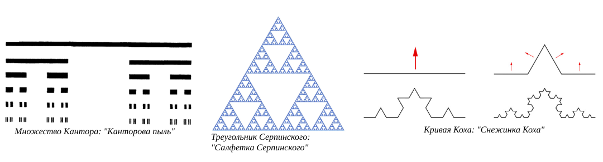

---
## Author
author:
  name: Жукова Арина, Садова Диана, Агаев Арсений, Диденко Дмитрий
  degrees: 3rd year student
  orcid: 0000-0002-0877-7063
  email: 1132239120@rudn.ru
  affiliation:
    - name: Российский университет дружбы народов
      country: Российская Федерация
      postal-code: 117198
      city: Москва
      address: ул. Миклухо-Маклая, д. 6
## Title
title: "Моделирование неравновесной агрегации: диффузионно-ограниченная агрегация (DLA)"
subtitle: "Этап 1: Модель. Презентация по научной проблеме"
license: CC BY
date: today
date-format: "YYYY-MM-DD"

---

# Информация

## Докладчики

:::::::::::::: {.columns align=center}
::: {.column width="70%"}

  * Жукова Арина
  * Садова Диана
  * Агаев Арсений
  * Диденко Дмитрий
  * студенты 3 курса
  * Российский университет дружбы народов им. П. Лумумбы

:::
::: {.column width="30%"}

:::
::::::::::::::

# Вводная часть

## Актуальность

- Ключевой процесс в природе и технике
- Примеры: сажа, дендриты, "вязкие пальцы", электрический пробой
- Понимание механизмов роста позволяет управлять этими процессами
- Модель DLA — основа для предсказания структуры агрегатов

## Объект и предмет исследования

- **Объект:** Процессы неравновесной агрегации в физических системах
- **Предмет:** Модель диффузионно-ограниченной агрегации (DLA) и фрактальные структуры, возникающие в её результате

## Цели и задачи

**Цель работы:** Изучение процесса неравновесной агрегации и его математическое моделирование

**Задачи:**

1. Изучить теоретические основы неравновесной агрегации и фракталов
2. Разработать концептуальное описание модели DLA на квадратной решетке
3. Проанализировать методы определения фрактальной размерности
4. Рассмотреть классические примеры математических фракталов

## Материалы и методы

- **Материалы:** научные статьи Уиттена и Сандера (1981), работы Мандельброта по фрактальной геометрии

- **Методы:**

  - Анализ литературных источников
  - Математическое моделирование
  - Методы вычислительной физики
  - Статистический анализ фрактальных структур

# Содержание исследования

## Фракталы и фрактальная размерность

**Фрактал** (от лат. *fractus* — дробный) — множество, обладающее свойством самоподобия и имеющее дробную размерность

**Евклидовы размерности:**

- Линия → *D* = 1
- Плоскость → *D* = 2
- Объемное тело → *D* = 3

**Фрактальная размерность:**

- Масса *m* связана с радиусом *R* степенным образом: *m* ~ *R^D*
- Для DLA-кластера на плоскости: *D* ≈ 1.71 ± 0.02
- Для DLA-кластера в пространстве: *D* ≈ 2.50

## Модель DLA: алгоритм 

**Diffusion Limited Aggregation (DLA)** — модель, предложенная Уиттеном и Сандером в 1981 году

1. Затравочная частица в центре решетки
2. Новая частица на окружности радиуса *Rmax*
3. Случайное блуждание по узлам
4. Прилипание при контакте с кластером
5. Удаление ушедших частиц
6. Повторение процесса

**Результат:** разветвленный фрактальный кластер

## Методы определения размерности

- **Метод сфер:** график ln *m(R)* от ln *R* → угловой коэффициент = *D*
- **Box Counting:** *N ~ L^(-D)*, подходит для природных объектов
- **Радиус гирации:** *N ~ Rg^D*, удобен для наблюдения за ростом

## Математические фракталы: классические примеры

| Фрактал | Размерность *D* |
|---|---|
| Множество Кантора | 0.631 |
| Кривая Коха | 1.262 |
| Треугольник Серпинского | 1.585 |

{#fig-cantor width=80%}

## Расширения модели

- **Химически-ограниченная:** вероятность прилипания *p* < 1 → более плотный кластер
- **Баллистическая:** прямолинейное движение → плотнее, изрезанная граница
- **Кластер–кластерная:** слипание кластеров → более разреженная структура

# Результаты этапа 1

## Что сделано?

- Изучена научная проблема неравновесной агрегации
- Описана модель DLA с алгоритмом
- Проанализированы методы определения фрактальной размерности
- Рассмотрены математические фракталы и расширения модели

# Выводы

## Основные итоги

- Простое правило → сложные разветвленные структуры
- Ключевой механизм: **экранирование** внутренних областей
- Фрактальная размерность *D* — универсальная характеристика
- Основа для последующей программной реализации

## Фракталы в природе и моделировании

> *"Компьютер не добавляет возможностей человеку, а умножает их"*

# Рекомендуемая литература

## Основные источники

1. Д. А. Медведев, А. Л. Куперштох, Э. Р. Прууэл, Н. П. Сатонкина, Д. И. Карпов Моделирование физических процессов на ПК: Учеб. пособие. - Новосибирск: Новосиб. гос. ун-т., 2010. - 101 с.

2.  Мандельброт Б. Фрактальная геометрия природы. – Москва: Институт компьютерных исследований, 2002. – 656 с. (Оригинал: Mandelbrot B. B. The Fractal Geometry of Nature. – W. H. Freeman and Company, 1982).

