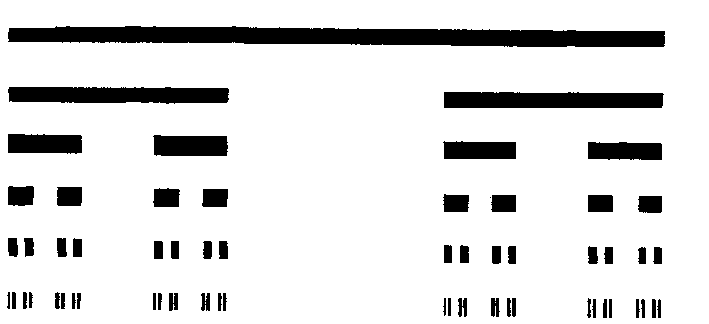
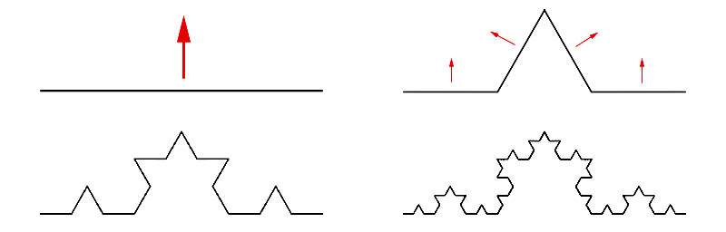
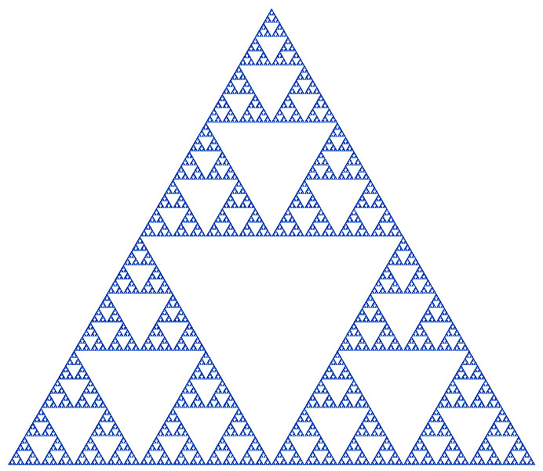

---
## Author
author:
  name: Жукова Арина, Садова Диана, Агаев Арсений, Диденко Дмитрий
  degrees: 3rd year student
  orcid: 0000-0002-0877-7063
  email: 1132239120@rudn.ru
  affiliation:
    - name: Российский университет дружбы народов
      country: Российская Федерация
      postal-code: 117198
      city: Москва
      address: ул. Миклухо-Маклая, д. 6
## Title
title: "Моделирование неравновесной агрегации: диффузионно-ограниченная агрегация (DLA)"
subtitle: "Этап 1: Модель. Презентация по научной проблеме"
license: CC BY
date: today
date-format: "YYYY-MM-DD"

---

# Информация

## Докладчики

:::::::::::::: {.columns align=center}
::: {.column width="70%"}

  * Жукова Арина
  * Садова Диана
  * Агаев Арсений
  * Диденко Дмитрий
  * студенты 3 курса
  * Российский университет дружбы народов им. П. Лумумбы

:::
::: {.column width="30%"}

:::
::::::::::::::

# Вводная часть

## Актуальность

- Неравновесная агрегация — ключевой процесс во многих природных и технологических системах
- Примеры: образование сажи, рост дендритов, электрический пробой, "вязкие пальцы" в нефтяных пластах
- Понимание механизмов роста фрактальных структур важно для управления этими процессами
- Моделирование DLA позволяет предсказывать структуру растущих агрегатов

## Объект и предмет исследования

- **Объект:** Процессы неравновесной агрегации в физических системах
- **Предмет:** Модель диффузионно-ограниченной агрегации (DLA) и фрактальные структуры, возникающие в её результате

## Цели и задачи

**Цель работы:** Изучение процесса неравновесной агрегации и его математическое моделирование

**Задачи:**

1. Изучить теоретические основы неравновесной агрегации и фракталов
2. Разработать концептуальное описание модели DLA на квадратной решетке
3. Проанализировать методы определения фрактальной размерности
4. Рассмотреть классические примеры математических фракталов

## Материалы и методы

- **Материалы:** научные статьи Уиттена и Сандера (1981), работы Мандельброта по фрактальной геометрии

- **Методы:**

  - Анализ литературных источников
  - Математическое моделирование
  - Методы вычислительной физики
  - Статистический анализ фрактальных структур

# Содержание исследования

## Неравновесная агрегация

**Определение:** Необратимое прилипание частиц к растущему кластеру в условиях сильного смещения равновесия в сторону твердой фазы

**Примеры:**

- Образование сажи при горении
- Рост дендритов при электроосаждении металлов
- "Вязкие пальцы" при вытеснении нефти водой
- Электрический пробой в диэлектриках

**Ключевое отличие от равновесного роста:**

- Равновесный рост → ограненные кристаллы
- Неравновесный рост → разветвленные фрактальные структуры

## Фракталы и фрактальная размерность

**Фрактал** (от лат. *fractus* — дробный) — множество, обладающее свойством самоподобия и имеющее дробную размерность

**Евклидовы размерности:**

- Линия → *D* = 1
- Плоскость → *D* = 2
- Объемное тело → *D* = 3

**Фрактальная размерность:**

- Масса *m* связана с радиусом *R* степенным образом: *m* ~ *R^D*
- Для DLA-кластера на плоскости: *D* ≈ 1.71 ± 0.02
- Для DLA-кластера в пространстве: *D* ≈ 2.50

## Модель DLA: основные принципы

**Diffusion Limited Aggregation (DLA)** — модель, предложенная Уиттеном и Сандером в 1981 году

**Ключевые этапы алгоритма:**

1. Помещение затравочной частицы в центр решетки
2. Генерация новой частицы на окружности радиусом *R_max*
3. Случайное блуждание частицы по узлам решетки
4. Необратимое прилипание при контакте с кластером
5. Удаление частицы, ушедшей за *2R_max*
6. Повторение процесса

## Методы определения фрактальной размерности: Метод сфер (ящиков)

- Применяется при наличии выделенной центральной точки
- Строятся концентрические окружности радиусом *R*
- Подсчитывается масса *m(R)* внутри каждой окружности
- Строится график ln *m(R)* от ln *R*
- Угловой коэффициент прямой → *D*

## Методы определения фрактальной размерности: Метод подсчета клеток (Box Counting)

- Не требует наличия центра
- Область с кластером покрывается сеткой с ячейками *L(i)*
- Подсчитывается число непустых ячеек *N(i)*
- Выполняется соотношение: *N* ~ *L^(-D)*
- Подходит для анализа природных объектов (береговая линия Норвегии: *D* ≈ 1.52)

## Методы определения фрактальной размерности: Метод радиуса гирации

- Характеризует разброс частиц относительно центра масс
- Радиус гирации: *Rg = √(⟨r²⟩)*
- Соотношение: *N* ~ *Rg^D*
- Удобен при наблюдении за процессом роста

## Примеры математических фракталов: множество Кантора ("Канторова пыль")

:::::::::::::: {.columns align=center}
::: {.column width="40%"}

**Построение:**

1. Взять отрезок
2. Выкинуть среднюю треть
3. Повторить для оставшихся отрезков

**Размерность:** *D* = ln2/ln3 ≈ 0.631

:::
::: {.column width="60%"}

{#fig-cantor width=80%}
:::
::::::::::::::

## Примеры математических фракталов: кривая Коха ("Снежинка Коха")

:::::::::::::: {.columns align=center}
::: {.column width="40%"}

**Построение:**

1. Взять отрезок
2. Заменить среднюю треть на два отрезка под углом 60°
3. Повторить для каждого отрезка

**Размерность:** *D* = ln4/ln3 ≈ 1.262
:::
::: {.column width="60%"}

{#fig-koch width=80%}
:::
::::::::::::::

## Примеры математических фракталов: треугольник Серпинского ("Салфетка Серпинского")

:::::::::::::: {.columns align=center}
::: {.column width="40%"}

**Построение:**

1. Взять равносторонний треугольник
2. Соединить середины сторон
3. Удалить центральный треугольник
4. Повторить для оставшихся треугольников

**Размерность:** *D* = ln3/ln2 ≈ 1.585
:::
::: {.column width="60%"}

{#fig-sierpinski width=80%}
:::
::::::::::::::

## Расширения базовой модели: химически-ограниченная агрегация

- Вероятность прилипания *p* < 1
- Частица может касаться поверхности несколько раз
- Проникает глубже в кластер → более плотная структура
- *D* увеличивается, но фрактальность сохраняется

**Вариация:** вероятность зависит от числа соседних занятых узлов

## Расширения базовой модели: баллистическая агрегация

- Частицы движутся по прямолинейным траекториям
- Моделирует осаждение из газовой фазы
- Результат: более плотный агрегат
- Граница агрегата сильно изрезана и является фракталом

## Расширения базовой модели: кластер–кластерная агрегация

- Одновременный рост множества кластеров
- Кластеры диффундируют и слипаются
- Коэффициент диффузии зависит от размера
- Агрегат более разрежен, чем при DLA: *D* < *D_DLA*

# Результаты

## Ключевые результаты этапа 1

- Изучена научная проблема неравновесной агрегации
- Описана классическая модель DLA с подробным алгоритмом
- Проанализированы три метода определения фрактальной размерности:
  - Метод сфер
  - Метод подсчета клеток
  - Метод радиуса гирации
- Рассмотрены математические фракталы с вычисляемыми размерностями
- Изучены расширения модели (химическая, баллистическая, кластер–кластерная агрегация)

## Значения фрактальной размерности

| Объект | Фрактальная размерность *D* |
|---|---|
| DLA-кластер на плоскости | 1.71 ± 0.02 |
| DLA-кластер в пространстве | 2.50 |
| Береговая линия Норвегии | 1.52 ± 0.01 |
| Множество Кантора | 0.631 |
| Кривая Коха | 1.262 |
| Треугольник Серпинского | 1.585 |
| Траектория броуновской частицы | 2.0 |

# Выводы

## Основные выводы

- Простое правило — необратимое прилипание диффундирующих частиц — порождает сложные разветвленные структуры
- Ключевой физический механизм: **экранирование** внутренних областей кластера внешними ветвями
- Фрактальная размерность *D* является универсальной характеристикой геометрии агрегата
- Все модификации модели изменяют *D*, но не устраняют фрактальную природу
- Полученные знания служат основой для последующей программной реализации

# Рекомендуемая литература

## Основные источники

1. Д. А. Медведев, А. Л. Куперштох, Э. Р. Прууэл, Н. П. Сатонкина, Д. И. Карпов Моделирование физических процессов на ПК: Учеб. пособие. - Новосибирск: Новосиб. гос. ун-т., 2010. - 101 с.

2.  Мандельброт Б. Фрактальная геометрия природы. – Москва: Институт компьютерных исследований, 2002. – 656 с. (Оригинал: Mandelbrot B. B. The Fractal Geometry of Nature. – W. H. Freeman and Company, 1982).

# Итоговый слайд

## Фракталы в природе и моделировании

> *"Компьютер не добавляет возможностей человеку, а умножает их"*

Модель DLA демонстрирует, как простые локальные правила взаимодействия частиц приводят к формированию сложных глобальных структур с универсальными фрактальными свойствами. Понимание этих механизмов позволяет прогнозировать рост и структуру агрегатов в широком классе физических систем — от наночастиц до геологических процессов.
