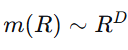
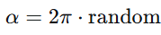
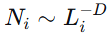
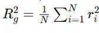
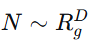

---
## Author
author:
  name: Жукова Арина, Садова Диана, Агаев Арсений, Диденко Дмитрий
  degrees: 3rd year student
  orcid: 0000-0002-0877-7063
  email: 1132239120@rudn.ru
  affiliation:
    - name: Российский университет дружбы народов
      country: Российская Федерация
      postal-code: 117198
      city: Москва
      address: ул. Миклухо-Маклая, д. 6

## Title
title: "Моделирование неравновесной агрегации: диффузионно-ограниченная агрегация (DLA)"
subtitle: "Этап 1: Модель. Презентация по научной проблеме"
license: "CC BY"
---

# Цель работы

Целью данной работы является изучение процесса неравновесной агрегации и его математическое моделирование. Основное внимание уделяется модели агрегации, ограниченной диффузией (Diffusion Limited Aggregation, DLA), а также методам анализа полученных структур, в частности, определению их фрактальной размерности.

# Задание

1.  Изучить теоретические основы процессов неравновесной агрегации и фрактальных структур.
2.  Разработать концептуальное описание модели DLA на квадратной решетке в соответствии с принципами, изложенными в литературе.
3.  Подготовить теоретическое введение, описывающее алгоритм модели, методы определения фрактальной размерности и примеры математических фракталов.

# Теоретическое введение

## Неравновесная агрегация и фракталы

Многие физические процессы в природе характеризуются неравновесной агрегацией — необратимым слипанием частиц с образованием кластера. Примерами являются образование сажи, рост осадков при электроосаждении, формирование "вязких пальцев" при вытеснении нефти водой. В условиях, далеких от равновесия, когда обратный переход частиц в раствор маловероятен, вырастают не компактные, а сильно разветвленные структуры, называемые фракталами.

Термин "фрактал" (от лат. *fractus* — дробный) был введен Бенуа Мандельбротом для обозначения множеств, обладающих свойством самоподобия и имеющих дробную размерность. Фрактальная размерность *D* является количественной характеристикой, описывающей, как масса объекта заполняет пространство. В отличие от привычных евклидовых размерностей (1 для линии, 2 для плоскости), для фракталов масса *m* связана с радиусом *R* степенным образом: 

{#fig-f1 width=30%}

где *D* — нецелое число. 

Например, размерность кластера DLA на плоскости составляет *D* ≈ 1.71 ± 0.02.

## Модель диффузионно-ограниченной агрегации (DLA)

Простейшей и наиболее изученной моделью неравновесной агрегации является модель DLA. В данной работе рассматривается её решеточная реализация.

**Основные принципы модели:**

1.  **Среда:** Используется регулярная (например, квадратная) сетка на плоскости.
2.  **Затравка:** В центре сетки помещается одна неподвижная частица-затравка.
3.  **Генерация частиц:** На достаточном удалении от кластера (например, на окружности радиусом немного больше максимального радиуса кластера Rmax) случайным образом генерируется новая частица. Угловая координата выбирается равномерно из интервала [0, 2π]: 

{#fig-f2 width=30%}

4.  **Диффузия:** Частица начинает случайное блуждание по узлам решетки. На каждом шаге она с равной вероятностью перемещается в один из четырех соседних узлов.
5.  **Агрегация (прилипание):** Если в результате блуждания частица попадает в узел, соседний с любым уже занятым узлом кластера, она останавливается и "прилипает" к нему, становясь частью кластера.
6.  **Удаление:** Если частица уходит далеко от кластера (например, за окружность радиусом *2Rmax*), она уничтожается, и процесс начинается заново с генерации новой частицы.

Процесс повторяется многократно, что приводит к росту древовидного, разветвленного кластера.

## Методы определения фрактальной размерности

Для анализа выращенных кластеров используются различные методы определения их фрактальной размерности *D*.

### Метод сфер (ящиков)

Данный метод применим, если у кластера есть выделенная центральная точка. Строятся концентрические сферы (окружности на плоскости) различных радиусов *R* с центром в этой точке. Для каждой сферы подсчитывается масса *m(R)* — количество частиц кластера, попавших внутрь. Затем строится график зависимости ln *m(R)* от ln *R*. Если точки ложатся на прямую линию, то её угловой коэффициент (тангенс угла наклона) и будет фрактальной размерностью *D*.

### Метод подсчета клеток (Box Counting)

Этот метод не требует наличия центра. Вся область, содержащая кластер, покрывается сеткой с размером ячейки *L(i)*. Подсчитывается число ячеек *N(i)*, в которые попала хотя бы одна частица кластера. Процедура повторяется для разных размеров ячеек (например, каждый раз уменьшая размер вдвое). Если выполняется соотношение, 

{#fig-f3 width=30%}

то *D* — искомая размерность. Этот метод хорошо подходит для анализа как искусственных, так и природных объектов, например, береговой линии.

### Метод радиуса гирации

В процессе роста кластера от центра удобно использовать радиус гирации *R(g)*, который характеризует средний разброс частиц относительно центра масс. Для кластера из *N* частиц с координатами *rᵢ* радиус гирации определяется, как

{#fig-f4 width=30%}

В этом случае также выполняется соотношение, согласно которому

{#fig-f5 width=30%}

## Примеры математических фракталов

Для лучшего понимания концепции фракталов полезно рассмотреть классические примеры, размерность которых вычисляется аналитически:

*   **Множество Кантора ("Канторова пыль"):** Получается путем многократного удаления средней трети из отрезков. Имеет размерность *D * = ln2/ln4 ≈ 0.631.

*   **Кривая Коха ("Снежинка Коха"):** Строится путем замены средней трети каждого отрезка на два отрезка, образующих угол. Её размерность *D* = ln4/ln3≈ 1.262.

*   **Треугольник (салфетка) Серпинского:** Строится путем многократного удаления центральных треугольников. Его размерность *D* = ln3/ln2 ≈ 1.585.

Эти примеры демонстрируют, что фрактальная размерность находится между топологической размерностью объекта и размерностью пространства, в котором он находится.

# Выводы

В ходе выполнения первого этапа проекта была изучена научная проблема, связанная с неравновесной агрегацией и образованием фрактальных структур. Рассмотрена классическая модель диффузионно-ограниченной агрегации (DLA), описаны её ключевые алгоритмические шаги. Также были проанализированы основные методы количественного анализа фрактальных кластеров и приведены примеры идеальных математических фракталов. Полученные теоретические знания служат основой для последующей программной реализации модели и проведения вычислительных экспериментов.

# Список литературы{.unnumbered}

::: {#refs}
1. Д. А. Медведев, А. Л. Куперштох, Э. Р. Прууэл, Н. П. Сатонкина, Д. И. Карпов Моделирование физических процессов на ПК: Учеб. пособие. - Новосибирск: Новосиб. гос. ун-т., 2010. - 101 с.
2.  Мандельброт Б. Фрактальная геометрия природы. – Москва: Институт компьютерных исследований, 2002. – 656 с. (Оригинал: Mandelbrot B. B. The Fractal Geometry of Nature. – W. H. Freeman and Company, 1982).
:::
