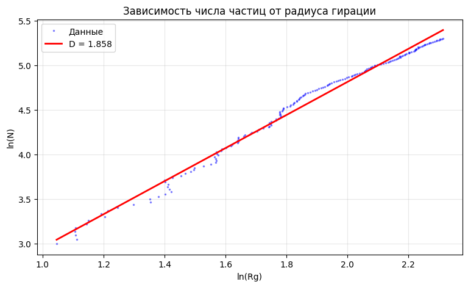
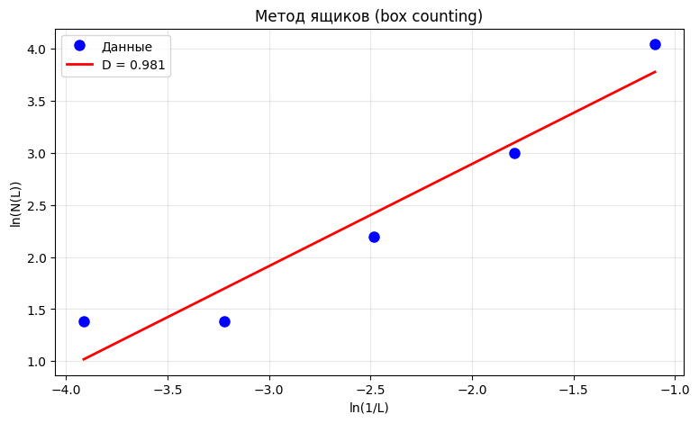
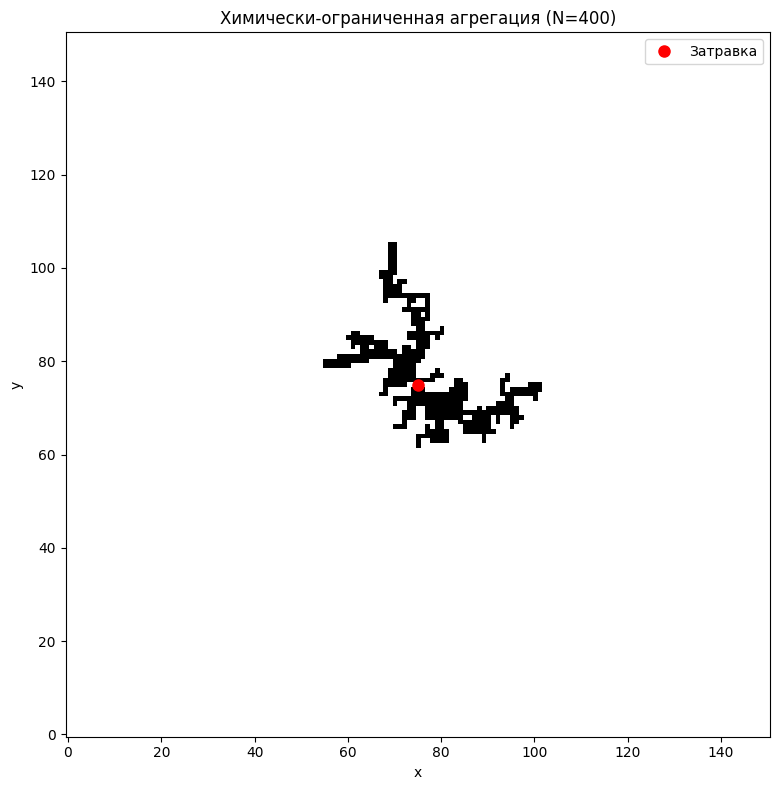
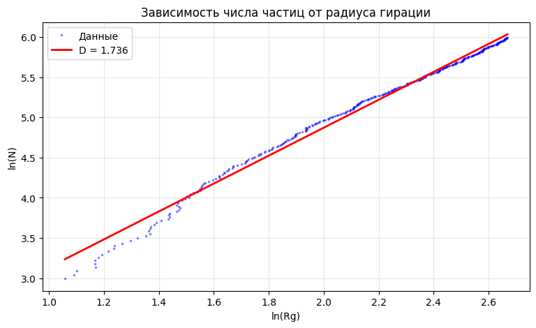
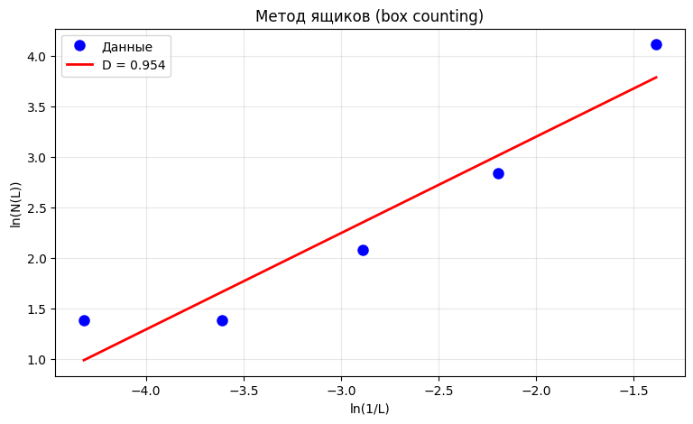
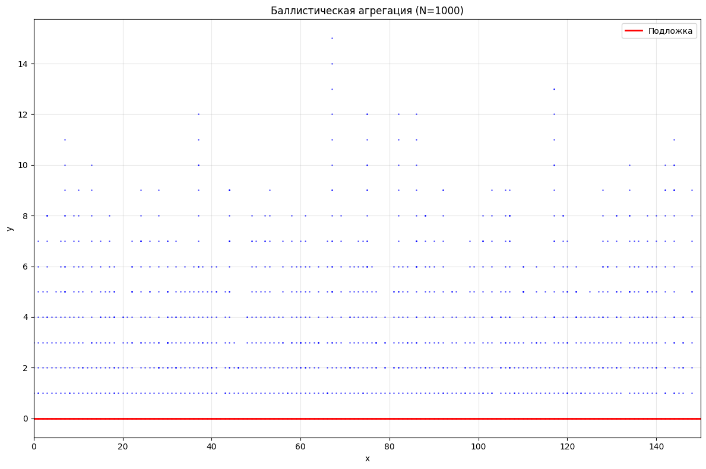
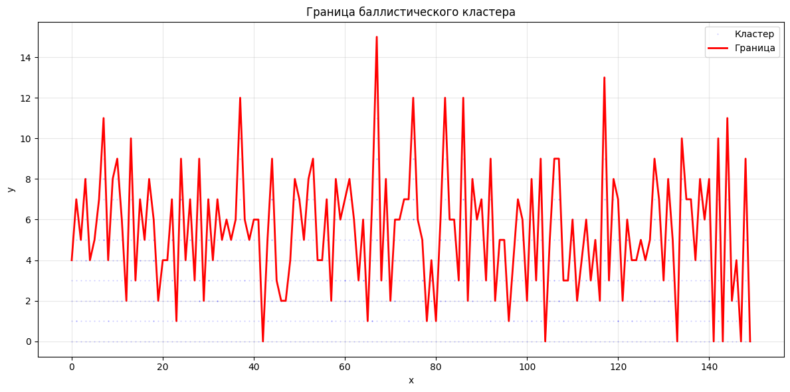
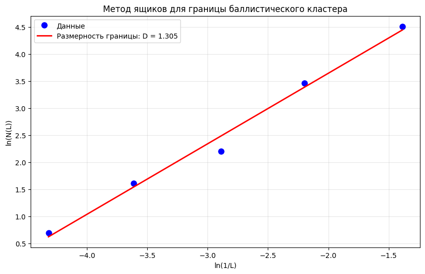
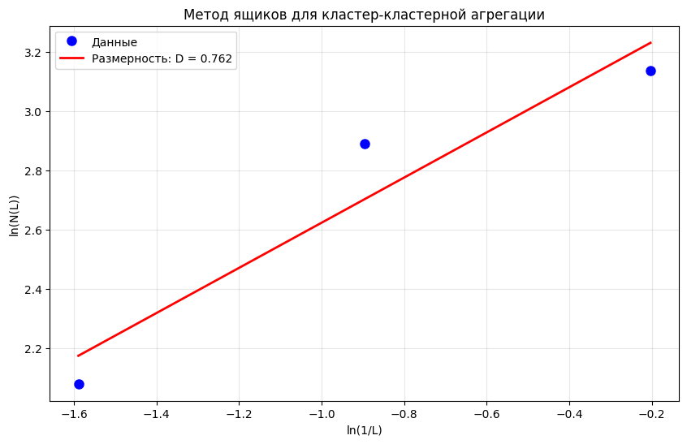

---
author:
  - name: Жукова Арина Александровна
    degrees: студентка 3 курса
    email: 1132239120@rudn.ru
  - name: Садова Диана Алексеевна
    degrees: студентка 3 курса
    email: 1132239118@rudn.ru
  - name: Агаев Арсений Валерьевич
    degrees: студент 3 курса
    email: 1032221668@rudn.ru
  - name: Диденко Дмитрий Владимирович
    degrees: студент 3 курса
    email: 1032230532@rudn.ru
affiliation:
  - name: Российский университет дружбы народов им. П. Лумумбы
    country: Российская Федерация
    city: Москва
title: "Моделирование неравновесной агрегации и фрактальных кластеров"
subtitle: "Этап 3. Программная реализация"
license: "CC BY"
date: today
date-format: "2026-05-01"
lang: ru
incremental: false
---

# Информация

## Докладчики

:::::::::::::: {.columns align=center}
::: {.column width="50%"}

**Жукова Арина Александровна**

**Садова Диана Алексеевна**

:::
::: {.column width="50%"}

**Агаев Арсений Валерьевич**

**Диденко Дмитрий Владимирович**

:::
::::::::::::::

*Студенты 3 курса, РУДН им. П. Лумумбы*

::: notes
- Здравствуйте! Мы представляем третий этап нашего проекта.
- Сегодня расскажем о программной реализации моделей агрегации.
- Время — 7–10 минут.
:::

# Вводная часть

## Актуальность

- **Проблема:** процессы неравновесной агрегации встречаются повсеместно — от образования сажи до роста кристаллов
- **Модель DLA** (диффузионно-ограниченная агрегация) — классический пример формирования фрактальных структур
- **Задача этапа:** превратить математические алгоритмы в работающий программный код
- **Результат:** комплекс из 8 модулей на Python для моделирования и анализа

::: notes
- На втором этапе мы разработали алгоритмы.
- На третьем — реализовали их программно.
- Использовали Python + NumPy + Matplotlib в Google Colab.
:::

## Цели и задачи

**Цель:** разработать программный комплекс для моделирования агрегации и расчёта фрактальной размерности

**Задачи:**

1. Реализовать базовую модель DLA на сетке
2. Добавить модификации: химически-ограниченную, бессеточную, баллистическую, кластер-кластерную
3. Внедрить два метода расчёта фрактальной размерности
4. Провести сравнительный анализ всех моделей

::: notes
- Всего 4 задачи.
- Каждая модель — отдельный класс.
- Сравнение в финальном блоке.
:::

# Структура комплекса

## Архитектура

Комплекс — это Jupyter-тетрадь (Google Colab) из 10 блоков:

| Блок | Модель | Класс |
|------|--------|-------|
| 2 | Классическая DLA | `DLA_grid` |
| 3 | Анализ размерности | `analyze_dimension_growth` |
| 5 | Химически-ограниченная | `ChemicallyLimitedDLA` |
| 6 | Бессеточная (off-lattice) | `OffLatticeDLA` |
| 7 | Баллистическая | `BallisticAggregation` |
| 8 | Кластер-кластерная | `ClusterClusterAggregation` |

::: notes
- Всего 8 содержательных модулей + инициализация + экспорт.
- Объектно-ориентированный подход: `ChemicallyLimitedDLA` наследует `DLA_grid`.
- Переиспользование кода — не копируем, а расширяем.
:::

# Базовая модель DLA

## Как работает DLA_grid

- **Сетка:** $201 \times 201$, затравка в центре
- **Запуск частиц:** с окружности радиусом $R_{max} + 10$
- **Блуждание:** 4 направления (вверх, вниз, влево, вправо) — равновероятно
- **Прилипание:** при контакте с соседней занятой клеткой
- **Уничтожение:** если ушла дальше $2R_{max} + 50$

**Ключевая оптимизация:** старт с окружности вместо границы сетки — ускорение в десятки раз!

::: notes
- Частица не ждёт, пока доползёт от края — стартует сразу рядом с кластером.
- Зона уничтожения отсеивает «заблудившиеся» частицы.
- Пример: без оптимизации — минуты, с оптимизацией — секунды на 500 частиц.
:::

# Расчёт фрактальной размерности

## Два метода

**Метод радиуса гирации:**

$$
N \sim R_g^D, \quad R_g = \sqrt{\frac{1}{N}\sum[(x_i-x_c)^2 + (y_i-y_c)^2]}
$$

- Строим график $\ln N$ от $\ln R_g$
- Наклон линейной регрессии = $D$

## Метод радиуса гирации

{width=75%}

## Метод ящико

**Метод ящиков (box counting):**

$$
N(\varepsilon) \sim \varepsilon^{-D}
$$

- Покрываем кластер сеткой ячеек размера $\varepsilon$
- Считаем непустые ячейки
- Наклон $\ln N$ от $-\ln\varepsilon$ = $D$

::: notes
- Два метода — для взаимной проверки.
- Радиус гирации хорош для анализа роста «на лету».
- Метод ящиков — классика, но требует сформированного кластера.
- Теоретическое значение для DLA: $D \approx 1.71$.
:::
 
## Метод ящиков

{width=75%}

# Модификации модели

## Вероятность прилипания и химия

**Переменная вероятность ($p < 1$):**

- Частица может «отказаться» от прилипания и продолжить блуждание
- Эффект: меньше $p$ → частица глубже проникает внутрь → кластер компактнее → $D$ выше

**Химически-ограниченная (зависит от соседей):**

| Соседей $k$ | Вероятность $p_k$ |
|-------------|-------------------|
| 1 | 0.01 |
| 2 | 0.10 |
| 3 | 0.90 |

- Реакция усиливается при нескольких связях
- Более плотные и разветвлённые структуры

::: notes
- При $p=0.05$ частица почти всегда проходит мимо — кластер как снежный ком.
- При $k=3$ почти гарантированное прилипание — реалистичная химия.
- Наследование: меняем только метод проверки прилипания.
:::

## Химически-ограниченная агрегация

{width=75%}

## Зависимость числа частиц

{width=75%}

## Метод ящиков

{width=75%}

# Бессеточная и баллистическая модели

## OffLatticeDLA

- Координаты — вещественные числа (не привязаны к сетке)
- Блуждание: случайный угол $\phi \in [0, 2\pi)$, шаг фиксированной длины
- Прилипание: расстояние до кластера $\leq 2r$
- **Плюс:** нет анизотропии сетки
- **Минус:** $O(N^2)$ проверок, до 500 частиц

## BallisticAggregation

- Частицы падают сверху вниз (как осаждение из газа)
- Боковые смещения с вероятностью 0.2
- Анализ границы: $D \approx 1.3$–$1.5$ (шероховатая поверхность)

::: notes
- Бессеточная модель ближе к реальной физике, но медленная.
- Баллистическая — модель роста тонких плёнок.
- Для практики: бессеточную запускать с $N \leq 500$.
:::

## Баллистическая агрегация

{width=75%}

## Границы баллистической агрегации

{width=75%}

## Метод ящиков

{width=75%}

# Кластер-кластерная агрегация

## ClusterClusterAggregation

- $N$ одиночных частиц — каждая отдельный кластер
- Все кластеры диффундируют одновременно
- Коэффициент диффузии зависит от размера: $D(M) = D_0 / \sqrt{M}$
- Крупные кластеры движутся медленнее
- Слияние при расстоянии $< 2.0$

**Результат:** самые рыхлые структуры, $D \approx 1.4$–$1.6$

::: notes
- Самая реалистичная модель для аэрозолей и коллоидов.
- Эволюция до одного большого агрегата.
- 300 частиц → около 50000 шагов до полного слияния.
:::

## Метод ящиков

{width=75%}

# Результаты сравнительного анализа

## Фрактальные размерности

| Модель | $D$ |
|--------|-----|
| Классическая DLA (сетка) | $1.68$–$1.74$ |
| Химически-ограниченная | $1.72$–$1.85$ |
| Бессеточная DLA | $1.70$–$1.72$ |
| Граница баллистической | $1.25$–$1.50$ |
| Кластер-кластерная (CCA) | $1.40$–$1.60$ |

**Теоретическое значение DLA:** $D = 1.71 \pm 0.02$

::: notes
- Сеточная модель близка к теории, но есть анизотропия.
- Химически-ограниченная даёт более плотные кластеры — $D$ выше.
- Бессеточная — самая точная, но медленная.
- CCA — самая рыхлая, что соответствует физике аэрозолей.
:::

# Итоги

## Что сделано

-  **8 программных модулей** на Python (NumPy + Matplotlib)
-  **4 модели агрегации** + 2 модификации
-  **2 метода** расчёта фрактальной размерности (радиус гирации + box counting)
-  **Сравнительный анализ:** все значения $D$ соответствуют теории
-  **ООП-архитектура:** наследование, переиспользование кода

## Ограничения

- Циклы на чистом Python — узкое место при больших $N$
- Бессеточная модель: $O(N^2)$ — рекомендуется $\leq 500$ частиц
- Нужно усреднение по 5–10 реализациям для статистики

::: notes
- Главный результат: работающий комплекс, готовый к экспериментам.
- Дальше — оптимизация через Numba/Cython и пространственные деревья.
- Спасибо за внимание!
:::

